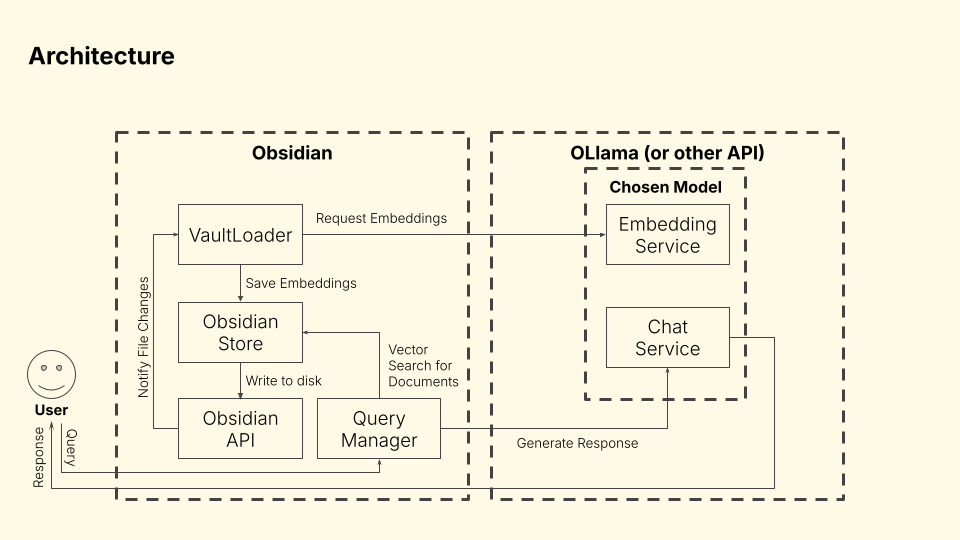

# Vault Query

[Obsidian](https://obsidian.md/) plugin to query your vault using [LangChain](https://langchain.com/).

View the demo and presentation for CS 6320 [here](https://youtu.be/usL-d-bmfLk).

Table of Contents
 - [Usage](#usage)
 - [Overview](#overview)

## Usage

#### Setup

Make sure that [Bun](https://bun.sh/) is installed.

```bash
git clone https://github.com/md-y/vault-query
bun install
```

If you have Obsidian installed, make sure you add your vault path to `.env`:

```bash
OBSIDIAN_PLUGIN_DIR="[VAULT DIR]/.obsidian/plugins"
```

#### Building

To build the plugin:

```bash
bun run build
```

To automatically build and copy files to your Obsidian vault, run:

```bash
bun run activate
```

To cleanup the plugin from the Obsidian plugin folder, run:

```bash
bun run deactivate
```

## Overview

Vault Query is a plugin for Obsidian that allows users to retrieve information from their vault via a chatbot with RAG. Obsidian itself is a popular note-taking tool that uses Markdown. Notes are stored locally in a directory called a vault. These notes can be connected, causing the vaults to become dense "mind-maps" of connected texts. This makes it a great dataset to query using an LLM.

#### Current Market

I have seen many posts on Reddit and the Obsidian forum asking about a chatbot for vaults. There are also some plugins that attempt to do this. Unfortunately, they are [unmaintained](https://github.com/ParthSareen/obsidian-rag) or rely on external programs. Since I also want such a chatbot, I decided to make one myself.

#### Requirements

A key selling point about Obsidian is that all data is stored locally, so:
 - All information needs to be stored locally
 - No external programs should be used (other than the LLM)

Obsidian is also performant, so we need to ensure:
 - Startup time and general performance are not impacted
 - Memory usage is limited
 - Querying is fast

Obsidian is made using Electron, so:
 - We need to use browser technologies (JavaScript, WASM, etc.)
 - Obsidian stores persistent data using JSON

#### Techstack

 - I used the JavaScript version of LangChain for managing documents and calling the model APIs.
 - I implemented a custom vector store based on [Voy](https://github.com/tantaraio/voy), which is a Rust vector search engine that can be compiled to WebAssembly. It is the most feature-rich browser-compatible engine I could find.
 - I used [Bun](https://bun.sh/) to build and bundle my TypeScript code into an executable plugin script. I also wrote some custom build plugins to make the other technologies work in Obsidian.
 - I primarily used [OLlama](https://ollama.com/) with Deepseek as my LLM. However, the program also supports OpenAI and other LangChain-supported APIs.

#### Architecture



#### The Vault Loader

The Vault Loader is in charge of loading, splitting, and embedding documents.

LangChain actually already has a loader for Obsidian markdown files. Unfortunately, it uses the NodeJS file system (`fs`) package, which Obsidian does not support. To fix this, I wrote a translation layer that converts file system calls to Obsidian API calls. The `fs` package is replaced by this new system via a custom Bun build plugin.

The vault loader also needs to be able to deal with a huge amount of changing documents. For example, my vault has over 600 documents. To accomplish this, I have a dynamic queue of un-embedded documents that is constantly updated through Obsidian file events. The queue is then processed using an async iterator so it can be paused during execution. This allows the user to pause and resume indexing as they wish.

#### Custom Obsidian Store

LangChain also has a vector store implementation for Voy. Unfortunately, it does not support deleting documents, saving the database, or loading it. These are all features that I need, so I wrote my own vector store.

My version is able to serialize and deserialize to/from JSON, so it can be stored by Obsidian. Individual documents can also be deleted. The documents are also keyed by their hash, so it is easy to remove outdated documents.

By implementing the vector store myself, I was able to keep all embeddings local in an Obsidian-esque manner.

#### Other Complex Implementations

In addition to the custom document processor and vector store, I did other advanced implementations:
 - I wrote my own WebAssembly bundler for Bun since it currently doesn’t support bundling WASM files.
 - I also wrote my scripts for automatically building and activating the plugin in Obsidian to speed up development
 - I used dependency injection to allow for multiple LangChain APIs to be supported such as OLama, OpenAI, and Grok.

#### Future Steps

Currently, whether or not a document is embedded is determined only by tags, but there should also be ways to filter by folder and content. Similarly, tags and other filters should also be supported in queries to help the LLM narrow the document context.

PDF and other files should also be supported. This shouldn't be too hard to add though since LangChain has loaders for these documents.

I also want to publish the plugin on the official Obsidian plugin hub. I actually want to use this program, so I will continue polishing it.
